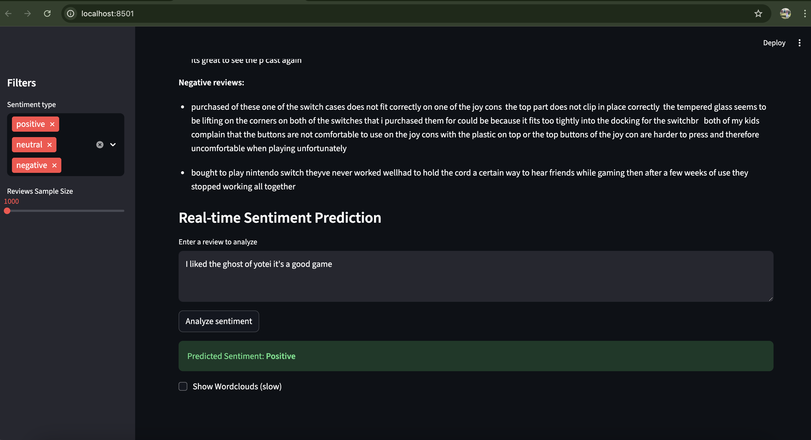

# Introduction

Sentiment Analysis with DistilBERT
This project leverages DistilBERT, a lightweight Transformer-based model, to deliver state-of-the-art sentiment analysis on customer reviews.

Why DistilBERT?
Efficiency: DistilBERT is a distilled version of BERT, retaining 97% of its language understanding power while being 60% faster and 40% smaller—making it ideal for real-time applications, dashboards, or serving APIs.

Transfer Learning: Pretrained on massive corpora, DistilBERT can be fine-tuned to classify sentiment with high accuracy, even on smaller datasets.

# How It Works in This Project
## 1. Data Preprocessing

Raw review text is cleaned, lowercased, and stripped of punctuation.

Ratings are mapped to sentiment labels:

Positive (rating > 3)

Neutral (rating = 3)

Negative (rating < 3)

## 2. Model Fine-tuning

The preprocessed data is split into training and test sets.

DistilBERT (via HuggingFace’s transformers library) is loaded with DistilBertForSequenceClassification.

The model is fine-tuned to predict sentiment (positive/neutral/negative) based on review text.

## 3. Tokenization

Each review is tokenized using the pretrained DistilBERT tokenizer, converting text to sub-word tokens and numerical IDs suitable for the model.

## 4. Training and Evaluation

The model learns to associate patterns in text with sentiment classes.

Experiment tracking is enabled with MLflow, and repeatable pipelines are managed using DVC.

## 5. Inference (Prediction)

For new or user-entered reviews, DistilBERT processes the input text and outputs predicted sentiment in real time.

The [CLS] token’s output is used as the overall sentence representation for classification.

Results are displayed instantly on the Streamlit dashboard or can be batch-evaluated for reporting.


## Setup

1. **Clone the repo and create a virtual environment**
    ```
    git clone https://github.com/<your-username>/sentimental-analysis.git
    cd sentimental-analysis
    python3 -m venv venv
    source venv/bin/activate   # On Windows: venv\Scripts\activate
    ```

2. **Install dependencies**
    ```
    pip install -r requirements.txt
    ```

3. **Download data**
    - Download Amazon per-category review data (like Video_Games_5.json.gz) from [UCSD Amazon Dataset](http://jmcauley.ucsd.edu/data/amazon/)
    - Place downloaded files in the `data/` folder

4. **Preprocess data**
    ```
    python preprocess.py
    ```

5. **Train the model**
    ```
    python train.py
    ```

6. **Evaluate**
    ```
    python evaluate.py
    ```

7. **Run dashboard**
    ```
    streamlit run dashboard.py
    ```

8. **Data and model versioning (optional)**
    ```
    dvc add data/Video_Games_5.json.gz
    git add data/Video_Games_5.json.gz.dvc .gitignore
    git commit -m "Add dataset with DVC tracking"
    dvc push
    ```

## Requirements

See `requirements.txt`. Main tools:

- Python >= 3.8
- pandas, numpy, scikit-learn
- transformers, torch, datasets
- streamlit, matplotlib, seaborn
- dvc, mlflow


## Example



## Usage

- View sentiment distribution and trends for your reviews
- Predict sentiment for any input review text in real time
- Track experiments and model improvements
- Extend for continuous retraining/MLOps workflows

## License

MIT

## Author

Anubhav Mandarwal ([Anubhav Mandarwal](https://github.com/VrityaCodeRishi))
